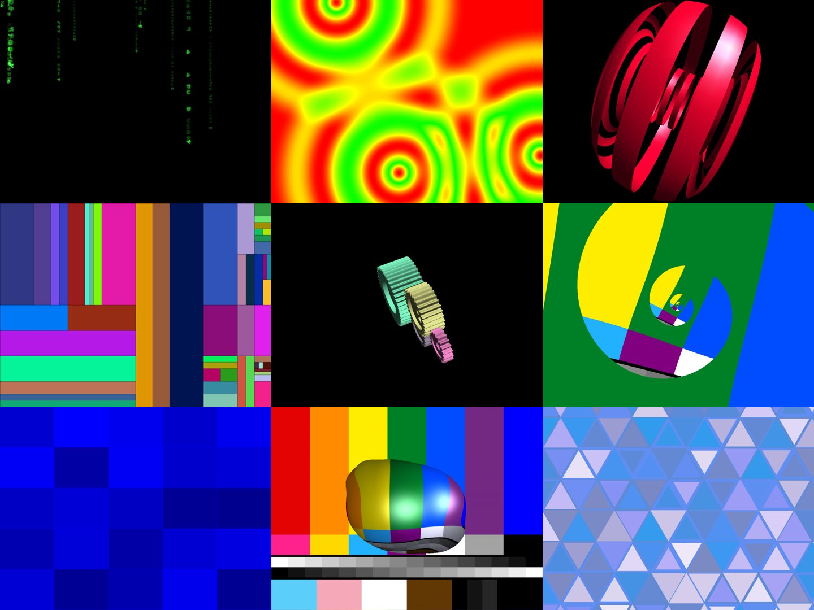

# xss-sdl2-gles2 — xscreensaver → SDL2 + OpenGL ES 2.0



A port of [xscreensaver](https://github.com/Zygo/xscreensaver)'s screen
hacks to **SDL2 + OpenGL ES 2.0**, building natively for Linux / macOS /
Windows and for the **web** via Emscripten/WebAssembly. One executable
(or one web page) per hack, compiled from the **unmodified** upstream
hack source.

**▶ Live gallery: https://erik-larsen.github.io/xss-sdl2-gles2/** — all
hacks running in the browser (click a thumbnail; press `Esc`/`Q` to
exit).

## Status

**233 / 233 shipping hacks pass** — every wired hack renders correctly,
verified headlessly (clean exit, non-blank, frame-to-frame motion) and
by eye, natively on macOS/ANGLE and as WebAssembly. `tests/STATUS.md`
tracks per-hack state; `MILESTONES.md` has the full development log.

| Area | State |
|---|---|
| 2D pipeline (jwxyz → CPU RGBA → GLES2 blit) | done |
| GL pipeline (gl4es + glues → GLES2) | done |
| Emscripten / WebAssembly build (all hacks) | done |
| Thumbnail gallery + GitHub Pages deploy | done |
| Real fonts (stb_truetype + Liberation subset) | done |
| textclient hacks (bundled text, no subprocess) | done |
| image-grab hacks (SMPTE colour-bars source) | done |
| Native CI: Linux ✓ · macOS ✓ · Windows | Windows WIP |

**Deferred** (a handful of ~250 upstream hacks): the analogtv family
(apple2, xanalogtv, bsod) and phosphor's terminal glyph pipeline;
`molecule` (needs upstream PDB data), `xshadertoy` (shader asset
bundling), `noseguy` (image assets), `extrusion`. See `MILESTONES.md`.

## Architecture

```
                  hack .c (unmodified xscreensaver source)
             ┌───────────────┴────────────────┐
        2D hacks                            GL hacks
             │                         GL 1.x/2.x    GLU calls
       jwxyz-image                          │            │
      (draws into a                         │      glues (tess /
       CPU RGBA buffer)                      │     quadrics / mipmap)
             │                              └──────┬─────┘
             │                                   gl4es
             │                          (translates GL → GLES2,
             │                        renders into its own FBO texture)
             ▼                                    │
   driver uploads the buffer            gl4es blits its FBO
   and draws one textured quad          to the window at swap
             │                        (via the pre_swap hook)
             └───────────────┬────────────────┘
             SDL2 driver — one GLES2 context, window swap
        (sgi-demos pattern; emscripten shares the tick() loop)
```

Both sides render into a texture and blit it to the window; they differ
only in who owns that texture — the driver's CPU-uploaded surface for 2D
hacks, gl4es's internal FBO for GL hacks.

The port supplies platform hooks the mobile (Android/iOS) code path
already expects — text rendering (`src/port/jwxyz-font.c`, stb_truetype),
a text source (`textclient-sdl.c`), and an image source
(`grabclient-sdl.c`) — so the hacks compile unmodified. Vendored-library
edits are minimal and all tagged `PATCH(xss-sdl)`.

## Build & run

### Native (Linux)

```sh
sudo apt install cmake ninja-build libsdl2-dev \
  libgl1-mesa-dev libglu1-mesa-dev libgles-dev zlib1g-dev libpng-dev
cmake -B build -G Ninja && cmake --build build
./build/gears                     # interactive; Esc/Q quits
```

### Native (macOS)

```sh
brew install cmake ninja sdl2 libpng
cmake -B build -G Ninja && cmake --build build
./build/gears
```

macOS links a vendored ANGLE for GLES2 (`third_party/angle/lib-mac`); the
driver selects ANGLE's **Metal** backend automatically (much faster than
its default GL-on-Metal path).

### Web (Emscripten)

```sh
emcmake cmake -B build-web -G Ninja -DCMAKE_BUILD_TYPE=RelWithDebInfo
cmake --build build-web
sh scripts/deploy-web.sh build-web        # assembles web/ + gallery
cd web && python3 -m http.server          # then open localhost:8000
```

The web build stays at `-O2` (`-O3` miscompiles gl4es) and strips DWARF
(`-g0`) — debug info was ~77% of each `.wasm`.

### Driver CLI (every hack)

```
--width N --height N    window size (default 800x600)
--frames N              exit after N frames
--shot PATH.ppm         write the final rendered frame (GPU readback)
--fps                   print fps once per second
```

Plus each hack's own upstream options (`-speed`, `-count`, …), parsed
from its source; on the web these can also come from the page's query
string.

### Headless smoke tests

```sh
sh tests/smoke.sh build            # native (macOS direct; Linux xvfb)
python3 tests/harness.py --build build   # full per-hack status sweep
sh tests/smoke-web.sh build-web    # browser (headless Chrome)
```

## Layout

```
src/driver/        SDL2/GLES2 driver (xss_driver.[ch])
src/port/          jwxyz platform layer: fonts, text, image, GLX shims
src/web/           custom emscripten shell (full-window, no branding)
third_party/       xscreensaver, gl4es, glues, ANGLE, stb_truetype, font
cmake/             generated hack-registration includes
scripts/           gallery + font-embed + dep-generation tooling
tests/             smoke suites + STATUS sheet + harness
docs/, MILESTONES.md   design notes, per-milestone development log
```

## Licenses

This port's scaffolding is Apache-2.0 (`LICENSE`). Vendored components
keep their own: xscreensaver hacks (BSD-style, © Jamie Zawinski et al.),
gl4es (MIT), glues (SGI Free Software License B), stb_truetype (public
domain), Liberation fonts (SIL OFL 1.1), ANGLE (BSD-style).
